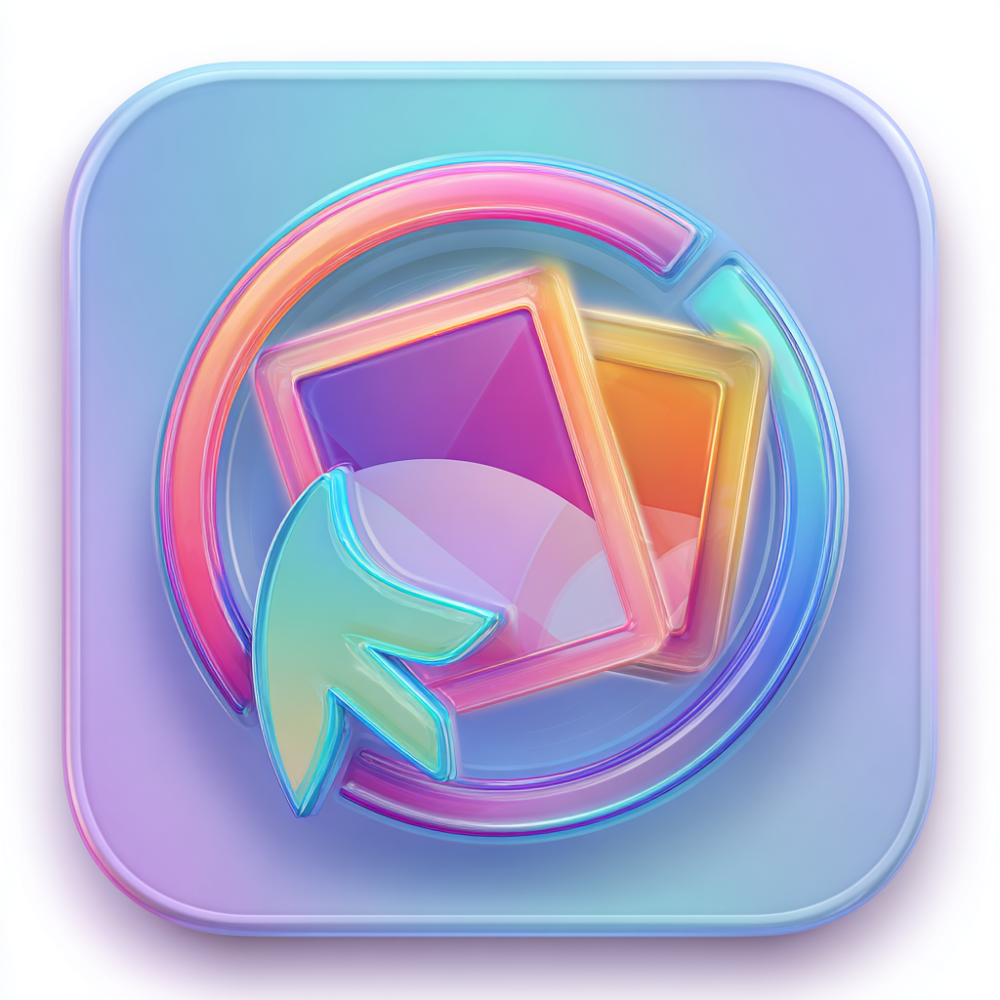

<p align="center">
  
</p>

# NoLa

Menu bar front-end para **yt-dlp** en macOS. Descarga videos y audio de X/Twitter y otros sitios directamente desde la barra de menú.

- Popover con TextEditor para una o varias URLs (una por línea)
- Selector Video / Audio con presets de calidad y formato
- Cola de descargas con estado por ítem: en cola / descargando / pausada / completa / error
- Pause y resume (conserva el `.part` entre sesiones)
- Preferencias: carpeta de descarga y formato personalizado de yt-dlp
- Binarios bundleados en el `.app` con fallback a Homebrew

---

## Requisitos

- macOS 14 Sonoma o superior (Apple Silicon / arm64)
- Xcode 15+
- [XcodeGen](https://github.com/yonas/XcodeGen): `brew install xcodegen`

---

## Dependencias externas

NoLa necesita **yt-dlp** y **ffmpeg**. Hay dos modos:

### (a) Bundleados en el .app — recomendado

Los binarios se incluyen en `NoLa.app/Contents/Resources/` para que la app sea autocontenida.

```bash
./scripts/download-deps.sh
```

El script descarga `yt-dlp` (release oficial de GitHub, binary universal macOS)
y copia `ffmpeg` desde tu instalación de Homebrew.

### (b) Homebrew — fallback automático

Si `Resources/yt-dlp` o `Resources/ffmpeg` no existen en el momento del build,
NoLa los busca en `/opt/homebrew/bin/` en tiempo de ejecución.

```bash
brew install yt-dlp ffmpeg
```

La resolución de binarios es: **bundle primero → Homebrew como fallback**.

---

## Build y primera ejecución

```bash
# Prerequisito (una sola vez)
brew install xcodegen
./scripts/download-deps.sh   # descarga yt-dlp y ffmpeg a Resources/

# Build + firma
./build.sh

# Abrir
open .build/Build/Products/Release/NoLa.app
```

`build.sh` hace tres cosas:
1. `xcodegen generate` — regenera `NoLa.xcodeproj` desde `project.yml`
2. `xcodebuild -configuration Release -arch arm64` — compila para Apple Silicon
3. `codesign -s -` — firma ad-hoc (sin notarización, uso personal)

### Gatekeeper

Al abrir la primera vez, macOS puede mostrar un aviso porque la app no está notarizada. Para abrirla:

```
Control+click → Abrir
```

O bien: **Configuración del Sistema → Privacidad y Seguridad → Abrir de todas formas**.

---

## Desarrollo (Debug)

```bash
/opt/homebrew/bin/xcodegen generate
xcodebuild \
    -project NoLa.xcodeproj \
    -scheme NoLa \
    -configuration Debug \
    -arch arm64 \
    -derivedDataPath .build \
    AD_HOC_CODE_SIGNING_ALLOWED=YES \
    build
open .build/Build/Products/Debug/NoLa.app
```

> **Nota:** `NoLa.xcodeproj` está en `.gitignore`. Siempre regeneralo con
> `xcodegen generate` (o `./build.sh`) antes de abrir en Xcode.

---

## Estructura

```
NoLa/
├── project.yml               # fuente de verdad del proyecto (XcodeGen)
├── build.sh                  # build + codesign
├── scripts/
│   └── download-deps.sh      # descarga yt-dlp y ffmpeg a Resources/
├── Resources/                # binarios bundleados (no versionados)
│   ├── yt-dlp                #   generado por download-deps.sh
│   └── ffmpeg                #   generado por download-deps.sh
└── Sources/
    ├── NoLaApp.swift          # @main + MenuBarExtra + Settings scene
    ├── ContentView.swift      # panel principal + ItemRow
    ├── SettingsView.swift     # preferencias (carpeta, formato)
    ├── DownloadManager.swift  # DownloadOptions + motor de descargas
    ├── DownloadItem.swift     # DownloadItem + PersistenceManager
    └── FormatPresets.swift    # MediaMode, VideoQuality, AudioFormat
```

Estado persistido en `~/Library/Application Support/NoLa/queue.json`.  
Preferencias en `UserDefaults` estándar (`com.rodrigogaray.nola`).
